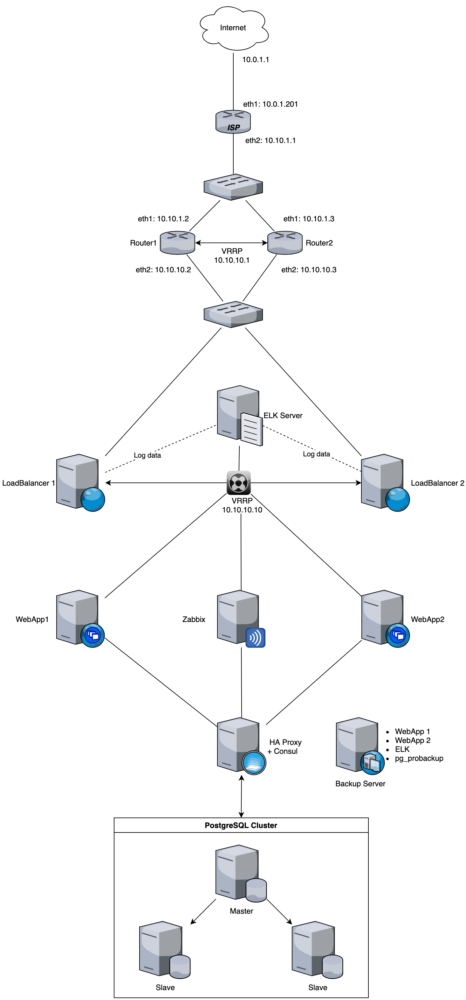

## Проектная работа

В проекте реализован WEB-сервис (Drupal CMS) высокой доступности. Для обеспечеения отказоустойчивости, кроме самого WEB-сервиса так-же продублированы маршрутизаторы, балансировщик нагрузки, база данных кластеризавана. Осуществляется мониторинг серверов с помощью Zabbix и сбор логов балансировщиков в Elasticsearch. Резервное копирование серверов WEB приложений осуществляется с помощью borgbackup, кластер PostgreSQL при помощи pg_probackup.

*Перед запуском стенда в файле **routers.yml** необходимо поменять IP адрес в переменной **ipv4_eth1:** роутера isp  на адрес из вашей локальной сети и прописать статический маршрут на сеть 10.10.0.0 255.255.0.0 через этот адрес*
```
- hosts: isp
  become: yes
  vars:
    ipv4_eth1: '10.0.1.201'
    ipv4_eth2: '10.10.1.1'
    ipv4_gw: '10.0.1.2'
```
После разворачивания стенда, будут доступны (имена прописаны в публичном DNS):
- https://cms.zzz.chat
- https://zabbix.zzz.chat (пароль в файле zabbix.yml)
- http://kibana.zzz.chat
## Схема проекта



### Принцип работы
1) Маршрутизаторы соеденины с Интернет провайдером двумя линками, и ретранслируют свои сети посредством протокола BGP. В случае отзаза одного из маршрутизаторов BGP перестраивает маршруты. На маршрутизаторах включер протокол VRRP и для внутренней сети они предоставляют один и тот-же адрес шлюза по умолчанию 10.10.10.1   
2) WEB трафик идет на балансировщик Nginx, который в свою очередь так-же продублирован с помощью VRRP и имеет адрес 10.10.10.10 Балансировщик раскидывает трафик между двумя серверами WEB приложений. Логи Nginx уходят на сервер Elasticsearch    
3) Базы WEB приложения и Zabbix сервера лежат в PostgreSQL кластере (Patroni), доступ к базам осуществляется через HA Proxy (на нем же сервер Consul) 
4) При настройке сервера бэкапов, происходит резервное копирование баз данных посредством pg_probackup, так же во время настройки серверов WEB приложений и Elasticsearch происходит их резервное копирование на сервер бэкапов с помощью borg backup
